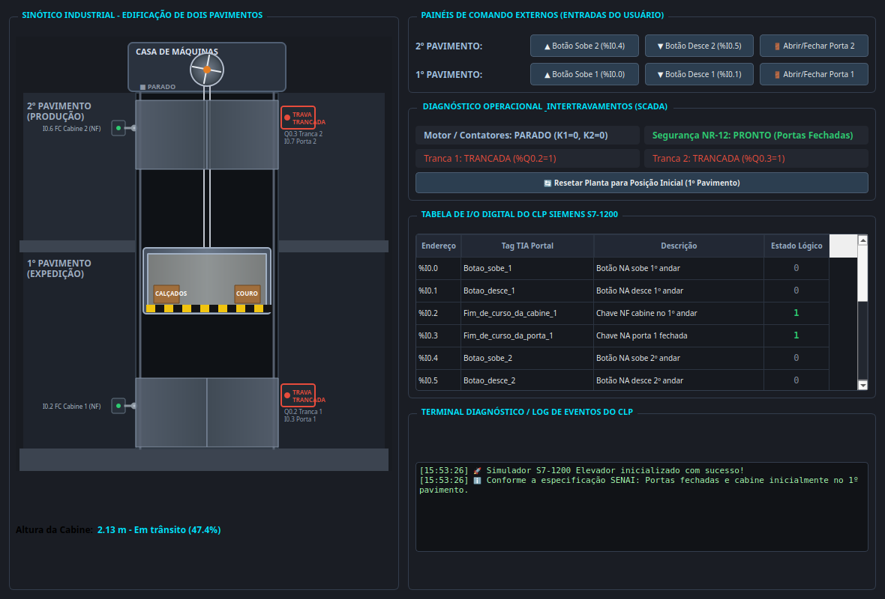

# Projeto_Elevador_s7-1200 — Controle e Simulação de Elevador de Carga Industrial (Siemens S7-1200)

[](https://www.siemens.com)
[](https://support.industry.siemens.com)
[](https://en.wikipedia.org/wiki/Ladder_logic)
[](https://www.senai.br)
[](https://pypi.org/project/PySide6/)

Projeto completo de automação industrial, segurança operacional (NR-12) e simulação gráfica interativa para o **Elevador de Carga Industrial (AutoControl - 2 Pavimentos)** em CLP **Siemens SIMATIC S7-1200**, desenvolvido para o ambiente de aprendizagem prática da Unidade Curricular de **Sistemas Lógicos Programáveis** (SENAI).

---

## 🚀 Download do Executável do Simulador (Windows)

[](https://github.com/Arthurdrm/Elevador-s7-1200/releases/latest/download/Simulador_Elevador_S7_1200.exe)
[](https://github.com/Arthurdrm/Elevador-s7-1200/releases/latest)

> 💡 **Pronto para rodar — Não precisa instalar Python nem configurar nada!**  
> Baixe o `Simulador_Elevador_S7_1200.exe` pelo botão acima ou pegue diretamente na pasta local [`dist/Simulador_Elevador_S7_1200.exe`](dist/Simulador_Elevador_S7_1200.exe).  
> Compatível com Windows 10 e Windows 11 (64-bit).

---

## 📸 Simulador Visual Interativo em PySide6



> O simulador reproduz o corte transversal da fábrica de calçados de 2 andares, guincho com motorredutor, cabos de aço duplos, portas industriais animadas, travas magnéticas eletromagnéticas, sensores de fim de curso NF com rolete físico, tabela de I/O em tempo real e painel de diagnóstico operacional SCADA com intertravamentos e status dos contatores!

---

## ⚡ Como Executar o Simulador Localmente

### No Linux:
```bash
./run_simulador.sh
# ou
python3 simulador.py
```

### No Windows:
Execute diretamente:
```cmd
python simulador.py
```
Ou compile o executável standalone (.exe) clicando 2 vezes em `build_exe.bat`.

---

## 📂 Estrutura do Repositório

```text
Projeto_Elevador_s7-1200/
├── src/
│   ├── Elevador_Controle_S7_1200.scl     # Arquivo SCL consolidado (Pronto para importar no TIA Portal)
│   ├── FB_Controle_Elevador.scl          # Bloco de Função com a máquina de estados e segurança
│   ├── DB_Elevador.scl                   # Bloco de Dados com tags de status e diagnósticos
│   ├── OB1_Main.scl                      # Ciclo principal OB1 com chamada do FB
│   └── simulador/
│       ├── __init__.py
│       ├── plc_s7_1200.py                # Emulador fiel do ciclo de scan da CPU Siemens S7-1200
│       ├── elevator_physics.py           # Cinemática da cabine, portas, cabos e sensores
│       └── ui_window.py                  # Interface gráfica SCADA/HMI em PySide6
├── tags/
│   ├── PLC_Tags_Elevador.csv             # Tabela de Tags oficial para importação no TIA Portal (CSV)
│   └── PLC_Tags_Elevador.xml             # Tabela de Tags formato Siemens TIA Portal XML
├── docs/
│   ├── ESPECIFICACAO_TECNICA.md          # Memorial descritivo da planta, análise de risco e NR-12
│   ├── LADDER_DIAGRAM_GUIDE.md           # Guia com todas as redes em Ladder (LAD) em diagramas ASCII
│   └── MANUAL_TIA_PORTAL.md              # Passo a passo completo para TIA Portal e S7-PLCSIM
├── tests/
│   ├── test_elevator_logic.py            # Testes unitários da lógica e intertravamentos
│   └── test_elevator_operation.py        # Testes de operação e paradas de segurança
├── dist/
│   ├── Simulador_Elevador_S7_1200.exe    # Executável portátil para Windows
│   └── preview_elevador.png              # Screenshot da interface gráfica em alta resolução
├── simulador.py                          # Ponto de entrada do simulador
├── run_simulador.sh                      # Script executável para Linux
├── run_testes.sh                         # Script para rodar bateria de testes pytest
├── build_exe.bat                         # Script para compilar .exe standalone no Windows
├── simulador_elevador.spec               # Spec do PyInstaller
├── test_demo_visual.py                   # Script de demonstração e relatório técnico no terminal
├── requirements.txt                      # Dependências Python
└── README.md                             # Este documento
```

---

## ⚡ Guia Rápido de Instalação (Siemens TIA Portal)

1. No TIA Portal, crie um novo projeto e adicione a CPU **S7-1200** (ex: **CPU 1214C DC/DC/DC**).
2. Em **PLC tags**, clique em **Import** e selecione o arquivo [`tags/PLC_Tags_Elevador.csv`](tags/PLC_Tags_Elevador.csv).
3. Para implementar em Ladder (LAD), abra o bloco **Main [OB1]** e siga as redes diagramadas no [Guia de Diagramas Ladder](docs/LADDER_DIAGRAM_GUIDE.md).
4. Ou, se preferir em SCL, vá em **External source files**, importe [`src/Elevador_Controle_S7_1200.scl`](src/Elevador_Controle_S7_1200.scl) e clique em **Generate blocks from source**.
5. Compile o projeto e carregue no CLP físico ou no **S7-PLCSIM**!

---

## ⚙️ Mapeamento Oficial de Entradas e Saídas (I/O)

### Entradas Digitais (%I)
| I/O | Tag Oficial | Tipo de Contato | Descrição |
| :---: | :--- | :---: | :--- |
| `%I0.0` | `Botao_sobe_1` | N.O. (NA) | Botão de impulso painel de comando no 1º pavimento |
| `%I0.1` | `Botao_desce_1` | N.O. (NA) | Botão de impulso painel de comando no 1º pavimento |
| `%I0.2` | `Fim_de_curso_da_cabine_1` | N.C. (NF) | Chave fim de curso posição da cabine no 1º pavimento |
| `%I0.3` | `Fim_de_curso_da_porta_1` | N.O. (NA) | Chave fim de curso posição da porta no 1º pavimento |
| `%I0.4` | `Botao_sobe_2` | N.O. (NA) | Botão de impulso painel de comando no 2º pavimento |
| `%I0.5` | `Botao_desce_2` | N.O. (NA) | Botão de impulso painel de comando no 2º pavimento |
| `%I0.6` | `Fim_de_curso_da_cabine_2` | N.C. (NF) | Chave fim de curso posição da cabine no 2º pavimento |
| `%I0.7` | `Fim_de_curso_da_porta_2` | N.O. (NA) | Chave fim de curso posição da porta no 2º pavimento |

### Saídas Digitais (%Q)
| I/O | Tag Oficial | Carga Acionada | Descrição |
| :---: | :--- | :---: | :--- |
| `%Q0.0` | `Motor_1_sobe` | Contatora K1 | Motor com sentido de rotação para subir a cabine (horário) |
| `%Q0.1` | `Motor_1_desce` | Contatora K2 | Motor com sentido de rotação para descer a cabine (anti-horário) |
| `%Q0.2` | `Tranca_magnetica_da_porta_1` | Eletroímã 24V | Tranca magnética da porta do 1º pavimento (1 = Trancada) |
| `%Q0.3` | `Tranca_magnetica_da_porta_2` | Eletroímã 24V | Tranca magnética da porta do 2º pavimento (1 = Trancada) |

---

## 🛡️ Modos de Operação e Segurança Funcional (NR-12)

O elevador opera com três pilares fundamentais de automação e segurança:

1. **Operação Local nos Pavimentos:**
   - Com a cabine no 1º pavimento: `Botao_desce_1` é ignorado. A porta 1 fica destrancada (`%Q0.2 = 0`). Ao acionar `Botao_sobe_1` com as portas fechadas, ambas as portas são trancadas (`%Q0.2 = 1` e `%Q0.3 = 1`) e o elevador inicia a subida até nivelar no 2º piso.
   - Com a cabine no 2º pavimento: `Botao_sobe_2` é ignorado. A porta 2 fica destrancada (`%Q0.3 = 0`). Ao acionar `Botao_desce_2` com as portas fechadas, ambas as portas são trancadas e o elevador desce até o 1º piso.
2. **Chamadas Externas (Despacho Remoto):**
   - Chamada externa realizada no 2º piso (`Botao_sobe_2`) estando a cabine no 1º piso: o elevador sobe automaticamente e, ao nivelar, destranca exclusivamente a porta do 2º piso.
   - Chamada externa realizada no 1º piso (`Botao_desce_1`) estando a cabine no 2º piso: o elevador desce automaticamente e, ao nivelar, destranca exclusivamente a porta do 1º piso.
3. **Intertravamentos Mandatórios de Segurança (NR-12):**
   - **Travamento cruzado:** `Motor_1_sobe` (%Q0.0) e `Motor_1_desce` (%Q0.1) nunca acionam simultaneamente.
   - **Bloqueio de partida:** O motor não parte se qualquer porta estiver aberta (`%I0.3 = 0` ou `%I0.7 = 0`).
   - **Parada de emergência imediata:** Caso uma porta seja aberta com o elevador em trânsito, os contatores são desenergizados instantaneamente.

---

## 🧪 Executando os Testes Automatizados

Para rodar todos os testes unitários e operacionais com pytest:
```bash
./run_testes.sh
```

Para ver o relatório interativo formatado no terminal:
```bash
python3 test_demo_visual.py
```
